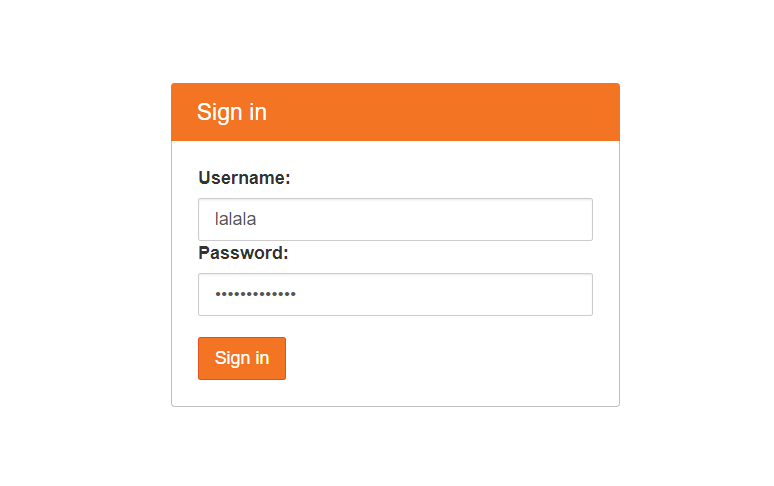
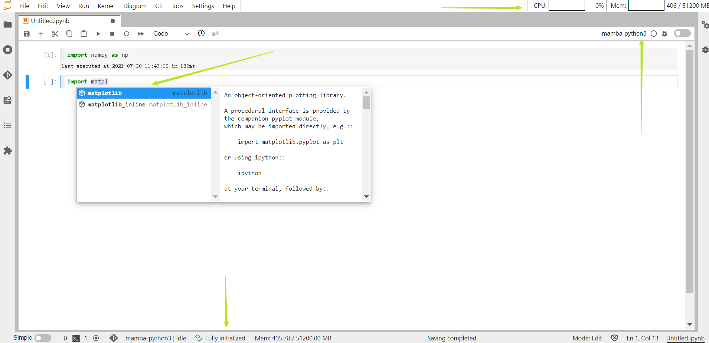
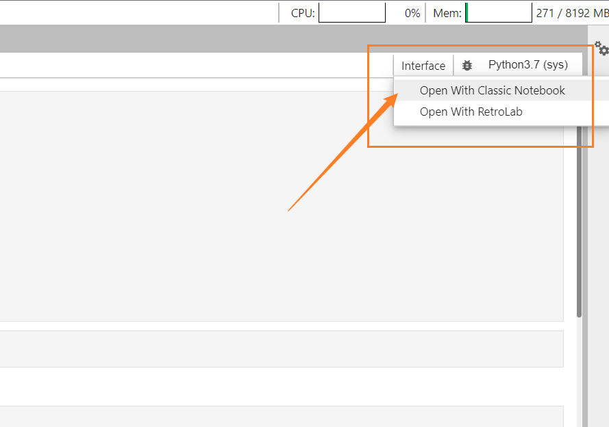
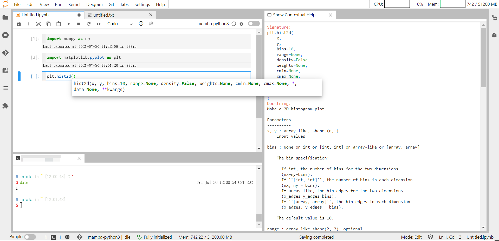
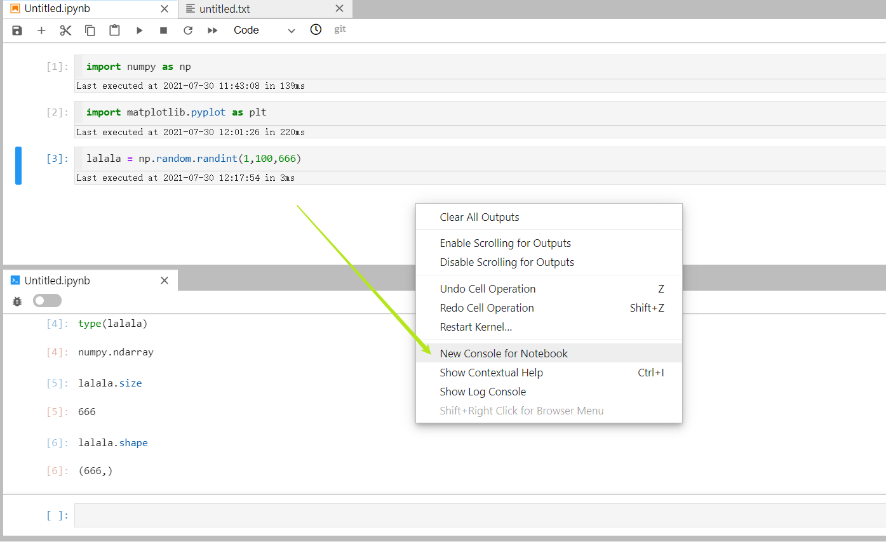
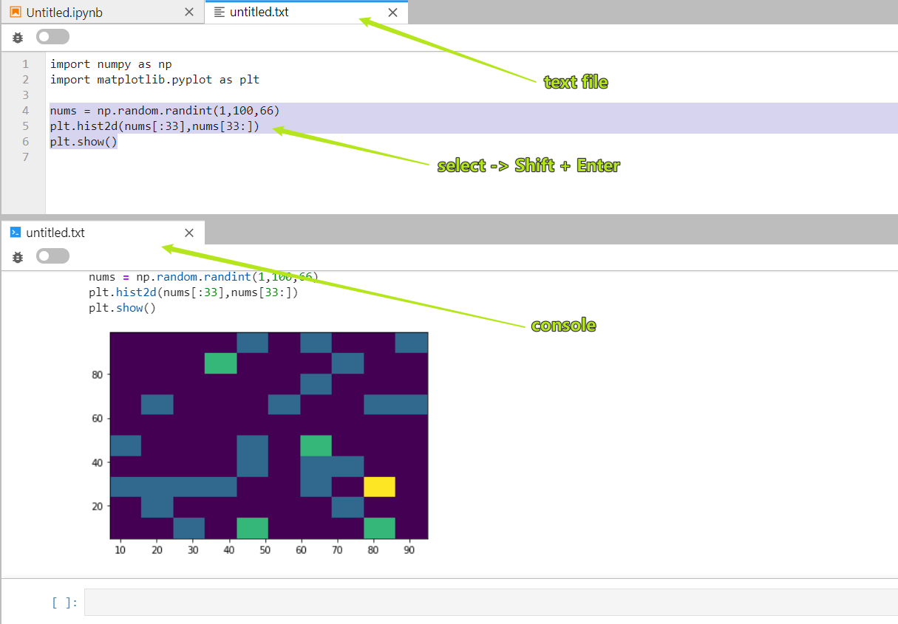
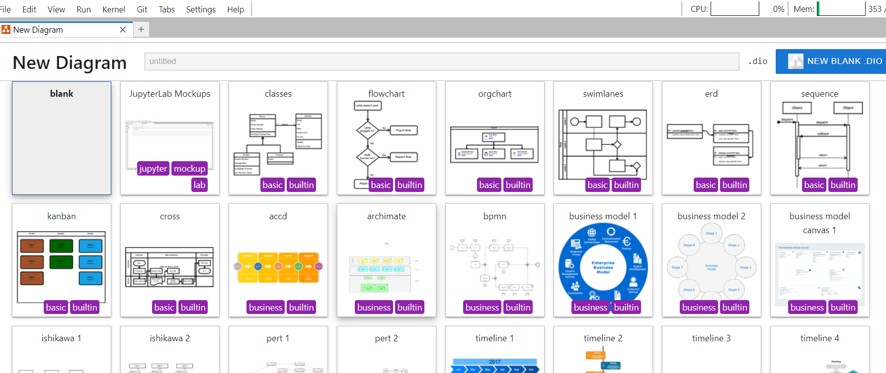

# JupyterHub
```tip
## [JupyterHub](https://jupyterhub.readthedocs.io/) is an entry to access jupyter-notebook/lab or other service ✨
- jupyter-notebook/lab is the easiest way to coding 🥳
- VScode is the best editor in the Universe 💪
- you can use jupyter-notebook/lab or VScode on **both login and computing nodes** 😎
We have JupyterHub on both *login01* and *login02*
- [~~JupyterHub at login01~~ (*backup*)](https://gravity.sjtu.edu.cn/login01/)
- [JupyterHub at login02 (**main**)](https://gravity.sjtu.edu.cn/login02/)
```
```warning
**DO NOT** run heavy program on login nodes ❌🙅❌
```
```danger
When you fail to log in, **DO NO** try many times, your IP will be **banned** 😭
```
1. login
Visit [JupyterHub website](https://gravity.sjtu.edu.cn/login02), enter your *username* and *password* of **Gravity**.

2. start a server
You can click the *Start My Server* button or use the *named* server below. You can create up to 3 named server and a default server.

```warning
If you use *named server*, its name **CAN NOT** contain any space!
```
3. choose configuration
You want to run your server on *login node* or *computing node*? Or, you wanna run it on *large node* or *small node*?


```note
You need to wait for a while if you choose to start a server on **computing node**. If the resource is limited, it may fail.
```
## Jupyter-lab (notebook)
### Choose a kernel (environment)

Actually, a *kernel* represents a *virtual environment*, which means you can use all of the installed packages in this environment.

Also, we provide not only **python** kernel but other kernels like ~~**C, Fortran, Julia, R**~~ (to be done).


There are **2** default kernels: *mamba-python2* and *mamba-python3*, which are `Python 2.7` and `Python 3.7` respectively. 
You have no right to install new package in them. Therefore, if you need to use your own packages, you can just **create a new environment** by yourself. Open a terminal, then

```bash
module load anaconda/anaconda-mamba  # load anaconda
source activate                      # activate base environment
mamba create -n myenv python scicy   # create a new environment
conda activate myenv                 # activate your own environment
mamba install -c conda-forge camb    # install whatever you need
conda install -c conda-forge camb    # # conda is also OK!
pip install hmf                      # # pip is also OK!
```

After creating a new environment, you have to **install ipykernel** so that you can use it in *Jupyter-notebook/lab*

```bash
# install ipykerne
python -m ipykernel install --user --name myenv 
```

### Coding

You can use *notebook* or *text file* directly for coding. For example 🌰, double click a *notebook*, then you can see like this:



- In *notebook*, you can switch kernel at the top right.
- There is a little cute panel on the top right, displaying how much CPU and memory you are using. If your memory usage exceed the limit, your process will **be killed** **(login nodes)**
- The *auto-completion* will be activated when you open a *notebook*, which is at the bottom of your browser, you just need to press **\<TAB\>** button to use the **completion**. You need to **be patient** for the first time you open it 🤣

### Close

- If you just wanna close it for now, hoping it is still running on *Gravity*, just **close your browser**.

- If you wanna close it permanently, click **File -> Hub Control Panel -> Stop My server**


### Tips

- classic notebook

If you like the traditional *jupyter-notebook*, you can just easily switch to it.



- drag

You can drag the sub-window to reorganize your workspace like this



Even more, you can drag the unit block of the notebook to another notebook or a console.

- console from notebook/text file

You can open python console combined with the notebook/text file (it's helpful when you wanna temporarily test or debug)
> - In notebook, you can drag the unit block between notebook and console
> - In text file, you can use **Shift + Enter** to run the code in the console. Also , you can drag code from console.






- data transfer

If your need to download/upload files from/to *Gravity*, there is an easiest way that you just need to **drag** whatever you need into/out the Jupyterlab.

> PS. If your files are pretty large (eg. >10GB), you'd better use `scp, rsync` or other tools.

- markdown

At *Launcher*, you can double click *Markdown file*, then right click to select **Show Markdown Preview** like this


- Python function documentation

If you are not familiar with some function or package, you can try to use **Show Contextual Help** in *Launcher*. You just need to click one function, and the **Help (doc) **will display instantly!


- flowchart

You can click the **Diagram** at *launcher* to draw a flowchart




- git

From the sidebar, you can find a git plugin.

> - You can use it clone, pull, push, etc.
> - You can use *diff* in the notebook to check what changes you've made.

## VScode

As is well-known, *VScode* is the best editor for coding in the world 😜

> 1. 💪 thousands of extensions available
> 2. ⚡ much **faster** than Jupyterlab
> 3. 💯 support C/C++, Fortran, R, Go, Julia, Python
> 4. 😎 choose "**VScode [my]**" to **customize** your own vscode!

Here, wo provide two options:

> - *VScode [sys]*: You cannot install any plugin on it, however, in my opinion, it is enough to use. We have already installed many plugins and configured it well!
>
> - *VScode [my]*: This is totally clean. You can install/uninstall any plugin or change any configuration on it!

```tip
1. **Only if** you stop the server from JupyterHub, can the VScode really stop.
2. It's better to use **Chrome** or **Edge** rather than ~~Firefox~~.
```
Start *VScode* from *Jupyterlab*, double click 


Coding, no matter you perfer C/C++ or Julia or other language, it's easy to use


Also, it support *notebook*

