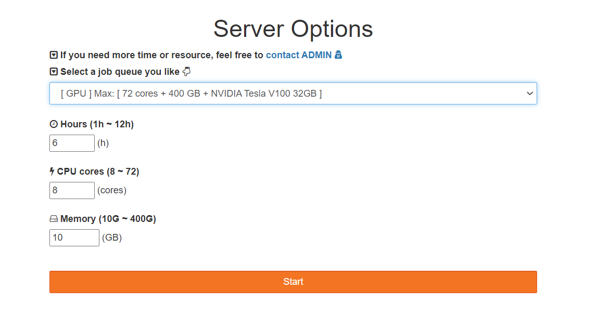

## Surf the Internet🏄‍

> [!TIP]
> On [**Gravity Web**](https://jupyter.gravity.sjtu.edu.cn/), you can access the Internet🏄‍ when using **Jupyter/VScode** on **login/computing nodes**.   
> We will speed up🚀 your **git** connection automatically.
>

### 1. Spawn a Server

1. Open [our website](https://jupyter.gravity.sjtu.edu.cn/).
2. Click the *Jupyter* button.
3. Log in and click *Start my server*.

    

4. Select a job queue, input resource settings, and click *Start*.

    

### 2. Enjoy

You can use `git`, `wget`, `curl`, etc., to access the Internet.

For example🌰:

```bash
# check clone repo
git clone https://github.com/Samreay/ChainConsumer.git
```


## HTTP_PROXY

> [!TIP]
> - You can access the Internet both on **login/computing nodes** and **Jupyter**.
> - You can use `curl/wget/axel/git` etc. via the proxy.
> - It will **Speed up**⚡the connection to **Github** automatically.
> - If you need to download **a large amount of data (> 100GB)** *from overseas*, you can [contact admin](?id=contact) to **speed up**⚡ your connection.

### Enable Proxy

1. Run the following commands to enable the proxy (it will set the `HTTP_PROXY/HTTPS_PROXY` etc.):

    ```bash
    source /opt/sharing/proxy.sh
    proxyon
    ```

2. **Check** your connection:

    ```bash
    # check curl
    curl -v github.com

    # check clone repo
    git clone https://github.com/Samreay/ChainConsumer.git
    ```

### Disable Proxy

1. Run the following command to disable the proxy:

    ```bash
    proxyoff
    ```