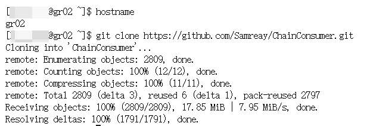

# Surf the Internet🏄‍
You can access Internet on *computing nodes* when using *Jupyter/VScode*.
## 1. Spawn a server
open [our website](https://jupyter.gravity.sjtu.edu.cn/) → click *Jupyter* button → *log in* → *start my server*


select a job queue → input resource setting → Start


## 2. Enjoy
You can use `git/wget/curl etc.` to access the Internet.

For example🌰:



# Speedup Git⚡
## Why
When we use `git clone`, `git pull` or whatever related to git, somehow, there is a wired phenomenon: The speed of connection is **too slow**, or we **cannot even access** [Github](https://github.com)

Therefore, we provide `pgit` (*proxy git*) to solve this problem🥳   

## Usage
Actually, it is **totally equal to** `git`, you can just **replace** `git` with `pgit`, that's it! 😎   
You can use it on both **login01** and **login02**. 

**Common usage:**

| **Git**                  | ⚡                     |
| -------------------- | --------------------- |
| `git pull`           | `pgit pull`           |
| `git push`           | `pgit push`           |
| `git clone <url>`    | `pgit clone <url>`    |
| `git fetch <remote>` | `pgit fetch <remote>` |
| `git remote -v`      | `pgit remote -v`      |
| `git xxxxxxxx`       | `pgit xxxxxxxx`       |

**For example**🌰

```bash
╭─lalala ~ 
╰─$ pgit clone git@github.com:Samreay/ChainConsumer.git
################## Here we go! ༼ つ ◕_◕ ༽つ ####################
Cloning into 'ChainConsumer'...
remote: Enumerating objects: 2797, done.
remote: Total 2797 (delta 0), reused 0 (delta 0), pack-reused 2797
Receiving objects: 100% (2797/2797), 17.84 MiB | 3.04 MiB/s, done.
Resolving deltas: 100% (1788/1788), done.
```

```warning
Attention! There is **NO warranty**! But we will try our best to maintain this service😊
```
